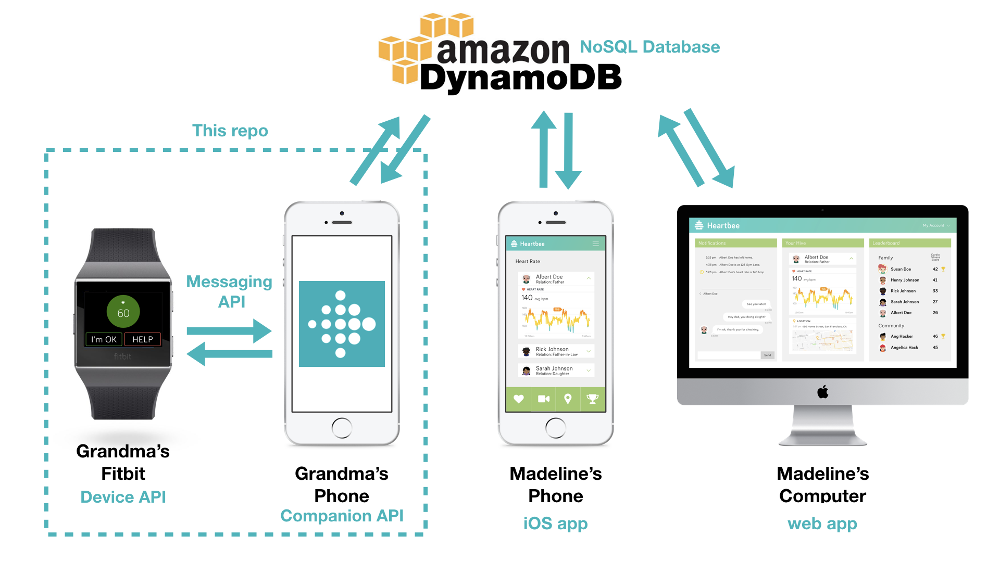
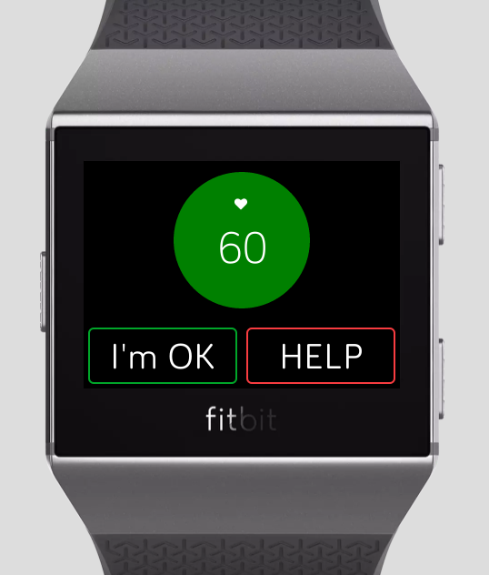
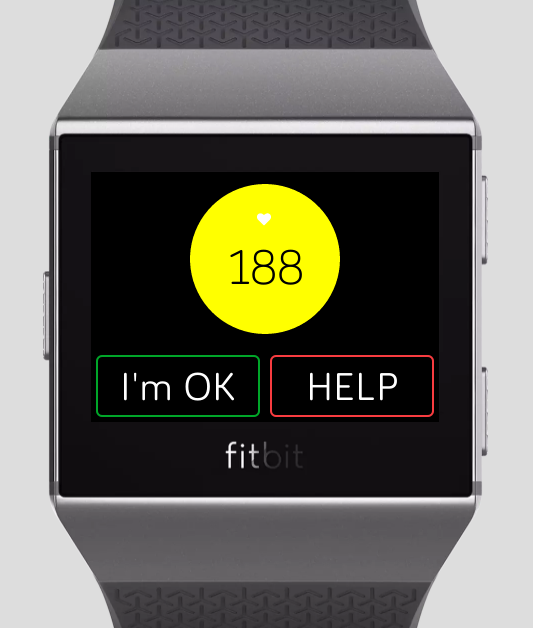
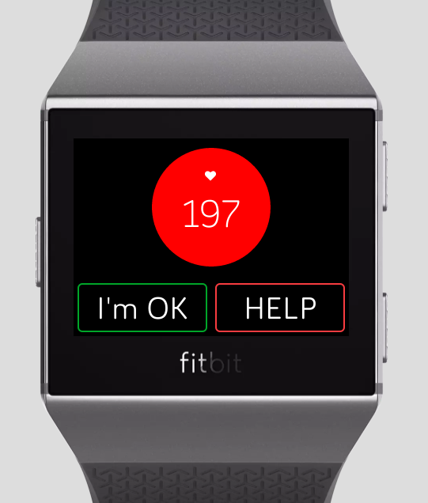
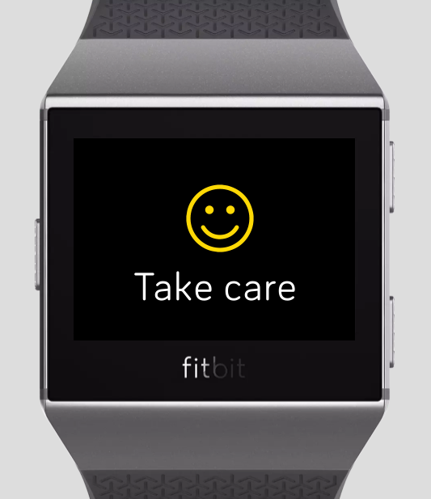
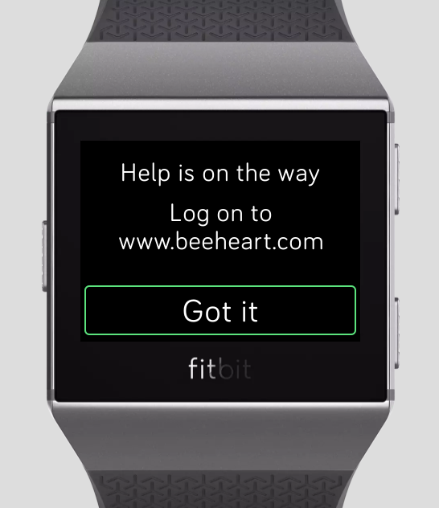

# Heartbee
Heartbee tracks senior users' heart rate real time using the [Fitbit](www.fitbit.com) watch. If the heart rate increases above a danger threshold and meets certain conditions, we will notify the senior's family and friends immediately and enable online video chat via our paired web and iOS apps. Care for your loved ones, easy as can bee.

Heartbee was born at [AngelHack San Francisco 2018](https://www.eventbrite.com/e/angelhack-san-francisco-hackathon-2018-tickets-45086935237#) over the weekend of July 28-29, created together with my amazing teammates: [Ami Zou](https://github.com/amigomushroom) (Software Engineer), [Gabi Stein](https://github.com/gabistein) (Product Manager + Database Enginner), and [Sophia Liu](https://www.linkedin.com/in/sophialiuinc/) (Designer).
This repo is for the Fitbit app, which I was responsible for. The frontend is in svg and css, and backend is in JavaScript. To see our paired web and iOS apps, check out [Ami's repo](https://github.com/amigomushroom/HeartBee-AngelHackSF2018).

## Awards
+ AngelHack's Code For A Cause Impact Award winner
+ Fitbit's Healthcare Challenge winner
+ HyperTrack's $1000 Challenge winner

## The Story
Imagine that Madeline is a busy young professional living in the city, and her grandma lives alone in Chinatown. Madeline's grandma has high blood pressure and heart disease. Even though grandma doesn’t speak English, she’s stubbornly independent, loves to do things herself like grocery shop. A month ago, Madeline went to grandma's place for dinner. Madeline arrived, found grandma on the ground short of breath. She was suffering from a fast heart rate. Madeline wished she could have taken care of grandma during an emergency like this, but it’s not easy to check up on your elderly parents when they insist on living alone.

San Francisco Chinatown is full of elderly citizens like Madeline's grandma. According to the statistics, more than 70% of them suffer from cardiovascular disease. We want to connect elderly parents and their family members in a way that doesn’t intrude on their independence, but make sure they’re being taken care of.

## System Architecture

## The Fitbit App
We created this seamless watch face with just two buttons. If everything is normal, the background will be green. If the heart rate goes near the danger threshold, the background will turn yellow as a warning. Currently we are using the formula (220 - user age) to calculate the danger threshold. Potentially we can come up with better and more customized algorithms. If the heart rate goes above the danger threshold, the background will turn red and the watch will start vibrating. Now if the user doesn't press the "I'm OK" button within 5 seconds, the watch will automatically notify the user's family and friends. If the user presses the "I'm OK" button, the watch will stop vibrating and cancel the notification. However, if the user isn't feeling well, he or she can press the "HELP" button at any time, and the watch will immediately send out notifications regardless of heart rate.

This message will show after the user presses the "I'm OK" button. It will auto disappear in 3 seconds.

This message will show after the user presses the "HELP" button. It will disappear after the user presses the "Got it" button. Currently we do not own "beeheart.com", but the idea is to ask the user to connect to our web app where video chat with family/friends will be auto started.

